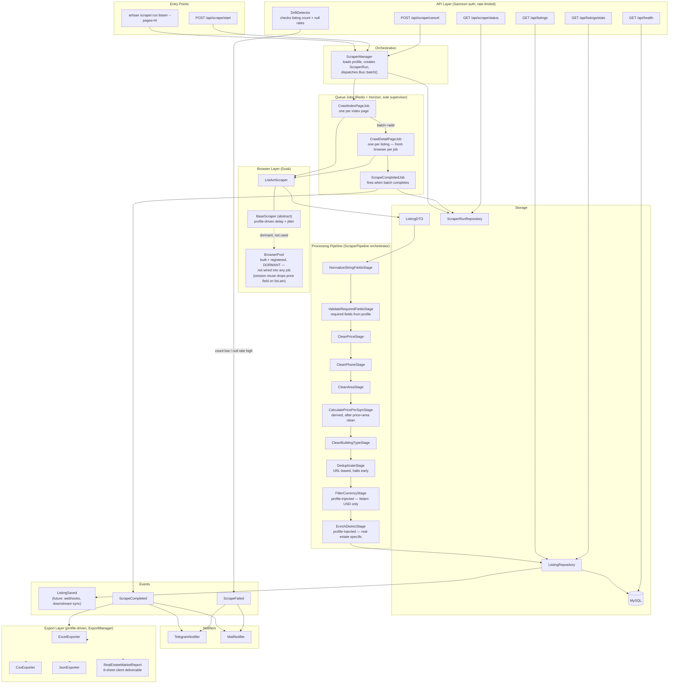

# ScrapKit 🕷️


Universal Laravel scraping template - build once, reuse for any site.

---

## What It Does

ScrapKit is a production-grade data extraction engine.
Add two files per new site. Everything else - queues, pipeline, deduplication, exports, notifications - works automatically.

**Currently scraping:** [list.am](https://list.am) - Armenia's largest classifieds platform (110,000+ active listings)
**Active client delivery:** Yerevan real estate market research for a real estate market entry client

---

## Part of a Larger Vision

ScrapKit is the data collection layer of a three-template system:

| Project      | Role                                                 |
| ------------ | ---------------------------------------------------- |
| **ScrapKit** | Extracts data from any website automatically         |
| **LaraAI**   | Analyzes and understands scraped data with AI        |
| **LaraKit**  | Admin dashboard - visualize results, control scrapes |

**Real-world example (Real estate client use case):**
ScrapKit → scrapes list.am every night → 10,000 new listings in database
LaraAI → "Kentron prices rose 8% this month"
LaraKit → Client team opens dashboard → live price map, trend charts, export reports

---

## Quick Start

```bash
git clone https://github.com/bokhuuu/ScrapKit
cd ScrapKit
cp .env.example .env
composer install
php artisan key:generate
php artisan migrate
php artisan scraper:run listam --pages=50
```

---

## Sample Output

A sample Yerevan real estate market research report is available in `/examples`:
examples/real_estate_market_report_sample.xlsx

Generated from 501 live Yerevan apartment listings. Contains 8 sheets:

| Sheet                 | Content                                         |
| --------------------- | ----------------------------------------------- |
| All Listings          | Full raw dataset - all scraped fields           |
| Market Overview       | Headline statistics - avg price, median, supply |
| District Analysis     | Pricing and supply breakdown per district       |
| Room Type Analysis    | Product mix and pricing by bedroom count        |
| Building Stock        | Construction type and condition distribution    |
| Price Distribution    | Market segmentation by price bracket            |
| Agency Intelligence   | Owner vs agency split, top participants         |
| Floor & Size Analysis | Price premium by floor, size, ceiling height    |

---

## Performance

> Redis active. BrowserPool built and available but not currently wired into the detail-page pipeline - see Known Limitations. Benchmarks pending.

| Mode                            | Expected throughput  |
| ------------------------------- | -------------------- |
| Single browser, 3s delay        | ~800 listings/hour   |
| BrowserPool parallel (Phase 10) | ~3,000 listings/hour |

---

## Adding a New Site

Two files. That's it.

**1. Create a profile** - describes the site:

```php
class SsGeProfile extends AbstractScraperProfile
{
    public function getName(): string { return 'ssge'; }
    public function getBaseUrl(): string { return 'https://ss.ge'; }
    public function getIndexUrlPattern(): string { return 'https://ss.ge/en/.../{page}'; }
    public function getMaxPages(): int { return 30; }
    public function getIndexSelectors(): array { return [...]; }
    public function getDetailSelectors(): array { return [...]; }
}
```

**2. Create a scraper** - extracts the data:

```php
class SsGeScraper extends BaseScraper
{
    public function crawlIndexPage(int $page): array { ... }
    public function crawlDetailPage(string $url): array { ... }
}
```

Queue, pipeline, dedup, export, notifications - zero changes needed.

---

## Architecture



---

## How It Avoids Detection

ScrapKit is built with responsible, polite scraping in mind:

- Per-domain rate limiting - configurable delay between requests via `config/scraper.php`
- Random jitter - delay randomized ±variance to avoid predictable patterns
- Stealth browser config - ChromeDriver fingerprint hardening via `StealthConfig`
- Retry with backoff - failed jobs retry automatically with exponential delay
- Respectful crawling - never hammers a server; mimics natural browsing pace

All values are environment-driven - no hardcoded delays anywhere.

---

## Deduplication Strategy

Every listing is identified by its **source URL** (unique per listing on every known target site).
Before saving, `DeduplicateStage` checks if the URL already exists in the database.
Duplicate → pipeline halts early, job completes cleanly. No double inserts, no wasted writes.

---

## Scheduling

ScrapKit integrates with Laravel Scheduler for fully automated runs:

```php
$schedule->command('scraper:run listam --pages=100')->dailyAt('02:00');
```

Configure in `app/Console/Kernel.php`. No cron setup needed beyond Laravel's standard scheduler entry.

---

## Error Handling & Logging

- All scraper errors logged to `storage/logs/scraper.log` with full context
- Failed queue jobs stored in `failed_jobs` table - inspectable and replayable
- `ScraperRun` model tracks full lifecycle: `pending → running → completed / failed`
- Telegram + email notification fired on `ScrapeFailed` and `ScrapeCompleted` events
- Sentry error tracking wired - set SENTRY_LARAVEL_DSN in .env to activate

---

## Proxy Support

Rotating proxy support via `ProxyResolver` service - configurable per profile.
Activate by setting `SCRAPER_PROXY_ENABLED=true` with proxy list in `.env`.

---

## Tech Stack

| Layer              | Technology                   |
| ------------------ | ---------------------------- |
| Framework          | Laravel 12, PHP 8.4          |
| Browser automation | Laravel Dusk + ChromeDriver  |
| Queue              | Redis                        |
| Cache              | Redis                        |
| Queue monitoring   | Laravel Horizon              |
| Export             | Maatwebsite Excel            |
| Notifications      | Telegram Bot SDK + SMTP Mail |
| Testing            | Pest                         |
| Code style         | Laravel Pint (strict_types)  |
| Database           | MySQL (utf8mb4)              |
| Deployment         | Docker + VPS Ubuntu 24.04    |
| CI/CD              | GitHub Actions               |

---

## Build Progress

### ✅ Foundation

- Laravel 12 + PHP 8.4 installed and configured
- MySQL database, queue driver set to redis
- Laravel Dusk installed
- Laravel Pint configured with strict_types enforcement
- Folder structure established, Git repository initialized

### ✅ Core Contracts

- ScraperProfileInterface, AuthStrategyInterface
- AbstractScraperProfile, ListAmProfile
- ListingDTO, ScraperState enum

### ✅ Database & Repository

- Listings migration (columns match ListingDTO exactly)
- ScraperRuns migration
- `Listing` model, `ScraperRun` model
- `ListingRepository`, `ScraperRunRepository`

### ✅ Processing Pipeline

- `PipelineStageInterface` contract
- `NormalizeStringFieldsStage`
- `ValidateRequiredFieldsStage` - required fields injected from profile
- `CleanPriceStage`, `CleanPhoneStage`, `CleanAreaStage`, `CleanBuildingTypeStage`
- `DeduplicateStage` - URL-based, halts early on duplicate
- `EnrichDistrictStage` - real estate specific, injected via ListAmProfile
- `ScraperPipeline` orchestrator
- `InvalidListingException`, `DuplicateListingException`
- `CalculatePricePerSqmStage` - derives price/sqm after price and area are clean
- `FilterCurrencyStage` - profile-injected, drops non-accepted currencies

### ✅ Browser Automation

- `BaseScraper` abstract class - profile-driven delay + jitter
- `StealthConfig` - ChromeDriver fingerprint hardening
- `ListAmScraper` - verified selectors, label-based spec extraction, image URL collection
- `config/scraper.php` - all settings configurable via `.env`
- `BrowserPool` - in-process pool, correctly built and registered as a singleton, currently dormant (not wired into any job) - see Known Limitations

### ✅ Authentication

- `CookieAuthStrategy` - cookie-first session restore, form login fallback
- `FormLoginStrategy` - fills email/password form, submits, confirms via DOM
- Cookie storage convention - `storage/app/scraper/cookies/{profileName}.json`

### ✅ Queue & Jobs

- `CrawlIndexPageJob` - one per index page, dispatches detail jobs in parallel
- `CrawlDetailPageJob` - crawl → DTO → pipeline → DB
- `ScrapeCompletedJob` - fires when batch completes, marks run finished
- `ThrottledRetryMiddleware` - backoff on retries
- `RateLimitedMiddleware` - concurrent job throttling per domain via Redis
- Failed job handling via `failed_jobs` table

### ✅ Orchestration

- `ScraperManager` - loads profile, creates ScraperRun, dispatches Bus::batch()
- `scraper:run` - start a scrape run from terminal
- `scraper:status` - check latest run state for a source
- `scraper:cancel` - cancel an active run by ID

### ✅ Events & Notifications

- `ListingSaved`, `ScrapeFailed`, `ScrapeCompleted` events
- `NotifierInterface` contract
- `TelegramNotifier` - instant alerts via Telegram bot
- `MailNotifier` - professional email notifications via SMTP
- `SendScrapeCompletedNotification`, `SendScrapeFailedNotification` listeners
- Profile-driven - each profile declares which notifiers fire

### ✅ Export Layer

- `ExporterInterface` - contract all exporters implement
- `ExcelExporter` - generic single-sheet Excel export
- `CsvExporter` - generic CSV export, machine-readable
- `JsonExporter` - generic JSON export, API/pipeline ready
- `ExportManager` - orchestrates all configured exporters post-scrape
- `TriggerScrapeExport` listener - bridges ScrapeCompleted event to ExportManager
- `RealEstateMarketReport` - 8-sheet client deliverable (District Analysis, Room Types, Building Stock, Price Distribution, Agency Intelligence, Floor & Size Analysis)
- Config-driven - formats declared in profile `getExports()`, classes resolved via `config/scraper.php`
- Sample report added to `/examples`

### ✅ Caching & Performance

- ✅ Redis setup
- ✅ Rate limiting per domain (RateLimitedMiddleware active)
- ✅ Cache scraped pages + price statistics
- ✅ Laravel Horizon queue monitoring
- ⬜ `BrowserPool` - built correctly, not currently wired into any job (see Known Limitations)
- ✅ `ProxyResolver` - rotating proxy support

### ✅ API Layer

- ✅ Sanctum authentication - token-based, one token per consuming project
- ✅ Security headers middleware - X-Content-Type-Options, X-Frame-Options, Referrer-Policy, X-XSS-Protection
- ✅ API rate limiting - 60 req/min global, 30 req/min per token (Redis-backed, config-driven)
- ✅ Per-token API rate limiting - fair usage per Sanctum token via named RateLimiter
- ✅ FormRequest validation - StartScrapeRequest, CancelScrapeRequest with config-driven source validation
- ✅ Data drift detection - fires ScrapeFailed if listing count too low or null rate too high on key fields
- ✅ POST /api/scrape/start - triggers scrape run, returns run_id, 202 Accepted
- ✅ GET /api/scrape/status - returns latest run state and progress
- ✅ POST /api/scrape/cancel - cancels active run by ID
- ✅ GET /api/listings - paginated listings with district/price filters
- ✅ GET /api/listings/stats - avg price per sqm by district, Redis-cached
- ✅ GET /api/health - database, Redis, queue status check

### ✅ Testing

- ✅ Unit tests for all pipeline stages - all 10 stages, 70 tests, 110 assertions total
- ✅ Repository tests with SQLite in-memory - ListingRepository + ScraperRunRepository
- ✅ Feature tests - ScraperManager, all 3 console commands, all API endpoints, ScraperPipeline
- ✅ CI test badge - GitHub Actions workflow added (Phase 13), no MySQL/Redis services needed since phpunit.xml uses SQLite in-memory and Bus::fake()

### ✅ Docker & Deployment

- `Dockerfile` - php:8.4-fpm, all required extensions, entrypoint re-applies storage permissions on every container boot
- `docker-compose.yml` - 6 services (nginx, app, horizon, chrome, mysql, redis) - worker service removed, Horizon is the sole queue supervisor to prevent oversubscribing Selenium Grid sessions
- GitHub Actions CI/CD pipeline - no MySQL/Redis services needed, phpunit.xml uses SQLite in-memory and feature tests use Bus::fake()
- `.env.example` fully documented - secrets stripped, structural defaults preserved
- Sentry error tracking integration - fully wired, only the DSN env var needs to be filled in
- `PRODUCTION_CHECKLIST.md` - deployment guide covering environment, security, queue/Horizon, browser automation, drift detection, and final checks

### ✅ Documentation

- ✅ Architecture diagram - Mermaid diagram embedded directly in this README (GitHub renders it natively), not a static image
- ✅ Postman collection for all API endpoints - collection + local environment in `/postman`, includes test scripts and run_id automation

---

## Known Limitations

- Phone numbers on list.am require authenticated login - Dusk handles this but adds scrape time per listing
- JavaScript-rendered pages require ChromeDriver - cannot use lightweight HTTP-only scraping for all sites
- BrowserPool is built and registered but not wired into CrawlDetailPageJob - reusing a browser across multiple list.am detail page navigations causes the site to stop serving the price field on the 2nd+ request within the same session. CrawlDetailPageJob uses fresh browser per job instead. BrowserPool remains available for future use where session reuse is safe (e.g. index page crawling, never tested for this issue).
- ProxyResolver implemented - activate by setting SCRAPER_PROXY_ENABLED=true with proxy list in .env
- Image galleries on list.am load lazily - only the first image captured per listing
- list.am does not expose individual agency names on listing pages - agency vs owner split is tracked, specific agency identity is not

---
